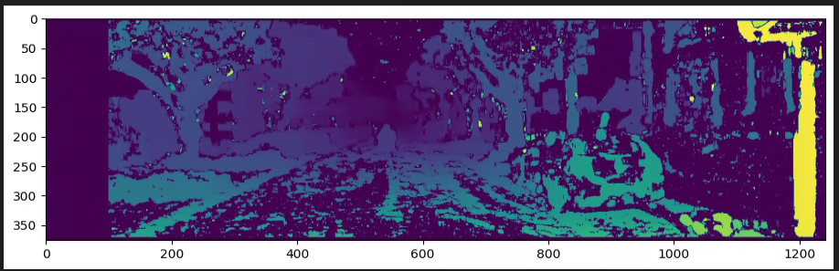
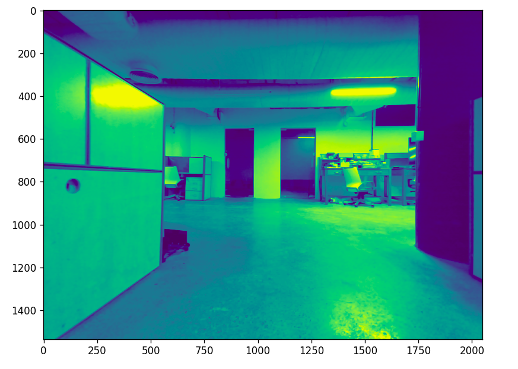
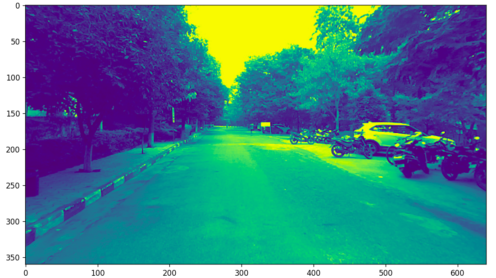
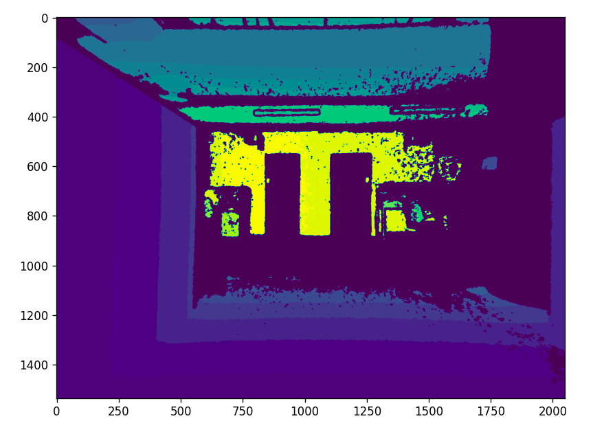
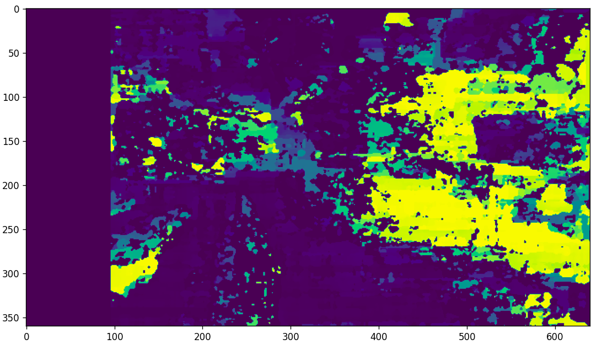
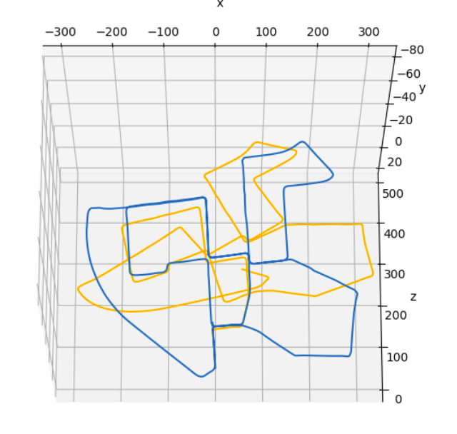
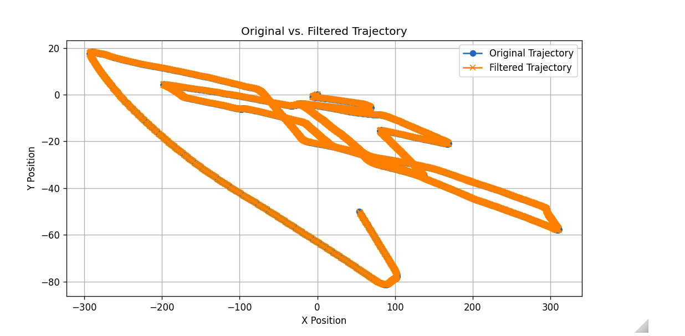
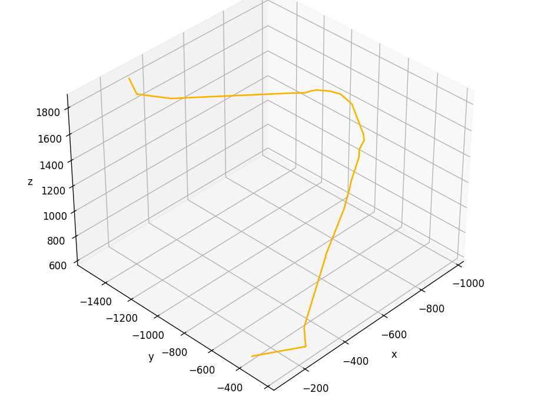
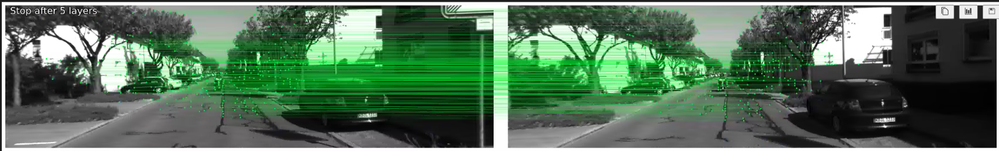

[](https://classroom.github.com/a/lVqgFAye)
[](https://classroom.github.com/online_ide?assignment_repo_id=13139627&assignment_repo_type=AssignmentRepo)

# Visual Odometry: <br/>

This Project computes Trajectory of the Camera from Stereo and RGBD Images.

**To Install:** OpenCV, Lightglue.

**Test2:** VO on Kitti Dataset. <br />



**Test3:** Indoor VO using RGDB camera( Lab dataset). <br />


**Test_campus:** VO on Campus data using Zed stereo camera( Self-driving Car dataset). <br />


**Light_glue_test:** VO using Light glue as feature matcher(Kitti dataset). <br />


## Basic Structure:
**Datahandler:** To load Stereo Data from 00 sequence Kitti data. <br />
**Compute Disparity:** Using SGBM and BM functions of CV2 gives us the disparity. compute_left_disparity_map(handler.first_image_left, handler.first_image_right,  matcher='sgbm') <br />
**Stereo_2_depth:** Computes the depth from the above calculated disparity and focal length. <br />
**Visualize_matches():** This calls functions: extract features, match features and filtered matches. Using SIFT, Orb , we match features and then apply a threshold value to filter out the features. <br />
**Estimate Motion:** Here we compute the motion between matched correspondences between frame 1 and 2 and get the rotation and translation using the depth of the matched keypoints. This is done using PNPRANSAC of cv2. <br />
**Visual Odometry():** Here we call all the above functions and store the trajectories from the Transformation matrix calculated from estimated motions function.<br />

# To run the Visual odometry function:<br />

```python
start = datetime.datetime.now()
trajectory_nolidar_bm = visual_odometry(handler,
                                      filter_match_distance=0.8, 
                                      detector='sift',
                                      stereo_matcher='sgbm',
                                      mask=mask,     
                                      subset=None)
end = datetime.datetime.now()
print('Time to perform odometry:', end-start)
```
  
**calculate_error():** Calculates rmse, mae and mse losses.

**Kalman filter:** Applies the Kalman filter on the resultant trajectory.


## Extra functions:

**Light_glue:** It is a deep learning based feature matcher, taking inputs in tensors and returns the data required after converting it to numpy.

# Results:
Depth map for Lab <br />
 <br />
Depth map for Campus <br />
 <br />
Ground Truth vs Estimated Trajectory for Kitti Dataset <br />
 <br />
Kalman Filter <br />
 <br />
Estimated Dataset for Campus <br />
 <br />
Feature Matching from LightGlue <br />
 <br />


**Dataset Link:**
[Dataset link](https://iiitaphyd-my.sharepoint.com/:u:/g/personal/priyansh_sinha_research_iiit_ac_in/EcGJ39mPM0ZGnwW7RPWIpcgBmmKKo-t8CQKbVKY2XEjtxQ?e=MqQjkl) <br />

Feel free to contact us for further clarifications.

**Contributors:** <br /> Priyansh Sinha <br /> Saksham Gupta <br /> Amitabh Sharma.


